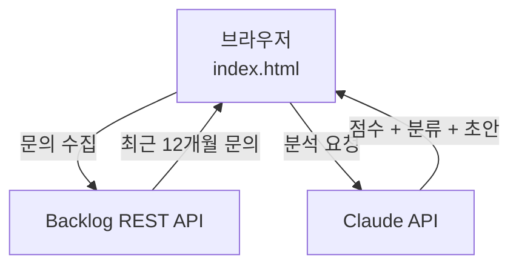

# DirectCloud FAQ 자동 분석 도구

> Backlog 고객 문의를 AI로 자동 분석하여 FAQ 후보를 선별하고 초안까지 생성해주는 브릿지 엔지니어 전용 도구

---

## 배경

매월 30~60분씩 소요되던 FAQ 후보 수작업 선별을 **5분 이내**로 단축하기 위해 만들었습니다.  
Backlog `DIRECTCLOUDINQUIRY` 프로젝트의 고객 문의를 Claude AI가 자동으로 분석합니다.

---

## 주요 기능

| 기능 | 설명 |
|------|------|
| 📊 FAQ 적합도 점수 | 각 문의에 1~5점 자동 산출 |
| 🏷️ 카테고리 자동 분류 | 파일공유 / 모바일 / 권한 / 인증 / 네트워크 등 |
| 🔗 유사 문의 그룹화 | 의미적으로 유사한 문의를 자동으로 묶음 |
| ✍️ FAQ 초안 자동 생성 | Q&A 형태 초안 자동 작성 |
| 🔗 Backlog 원본 링크 | 각 문의에서 Backlog 이슈로 바로 이동 |

---

## 시스템 구조



자세한 아키텍처는 [docs/ARCHITECTURE.md](docs/ARCHITECTURE.md)를 참고하세요.

---

## 사용 방법

1. `mockup/index.html`을 브라우저에서 열기
2. Backlog API 키 입력
3. Claude API 키 입력
4. **분석 실행** 버튼 클릭
5. FAQ 후보 목록 확인 및 초안 검토

---

## 프로젝트 구조

```
my-vibe-project/
├── README.md
├── ideation.md              # 1단계: 브레인스토밍 문서
├── development-plan.md      # 4단계: 개발 계획
├── docs/
│   ├── PRD.md               # 2단계: 제품 요구사항 문서
│   └── ARCHITECTURE.md      # 5단계: 아키텍처 문서
└── mockup/
    └── index.html           # 3단계: 동작하는 HTML 목업
```

---

## 워크숍 진행 현황

| 단계 | 내용 | 상태 |
|------|------|------|
| 0 환경설정 | GitHub 리포 생성 | ✅ |
| 1 문제 정의 | ideation.md | ✅ |
| 2 PRD 작성 | docs/PRD.md | ✅ |
| 3 목업 제작 | mockup/index.html | ✅ |
| 4 개발 계획 | development-plan.md + GitHub 이슈 12개 | ✅ |
| 5 아키텍처 | docs/ARCHITECTURE.md + README | ✅ |
| 6 튜토리얼 | 비개발자용 가이드 | 🔄 |

---

## 기술 스택

- **프론트엔드:** HTML + CSS + Vanilla JS (단일 파일)
- **AI 엔진:** Claude API (claude-sonnet-4)
- **데이터:** Backlog REST API v2
- **실행 환경:** 브라우저 (서버 불필요)

---

*비개발자를 위한 바이브 코딩 워크숍 실습 프로젝트*
