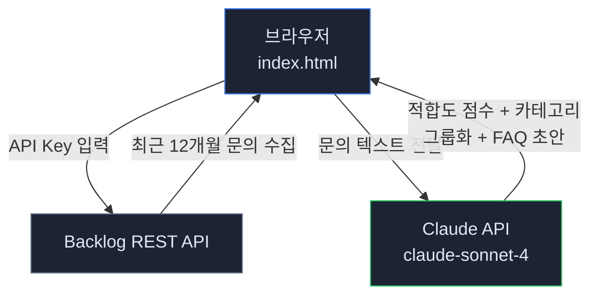
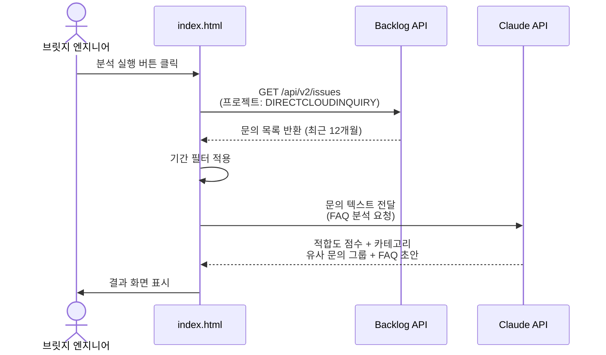
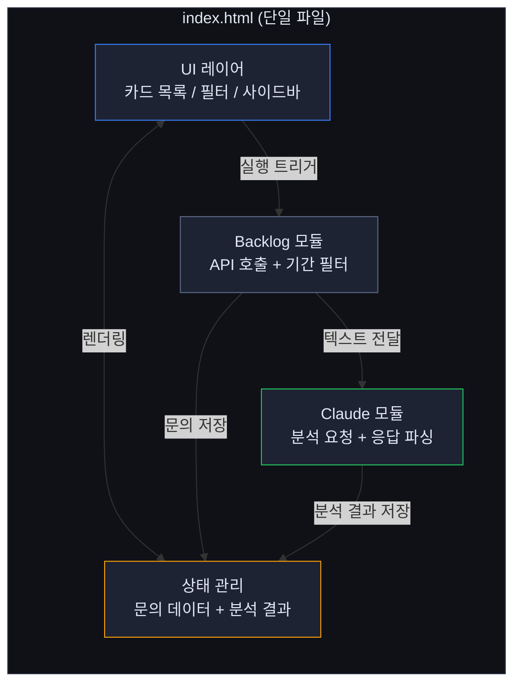
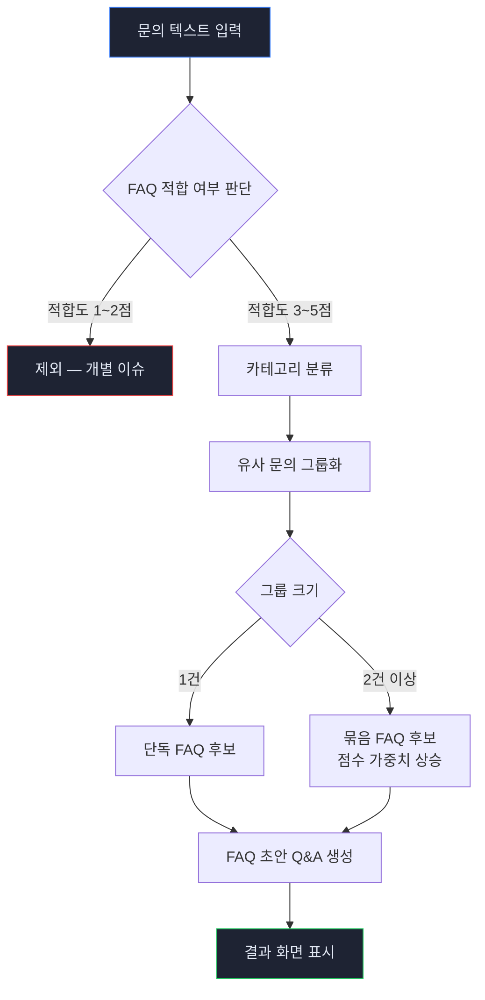

# 아키텍처 문서 — DirectCloud FAQ 자동 분석 도구

> 워크숍 5단계 산출물

---

## 1. 시스템 전체 구조

---

## 2. 데이터 흐름

---

## 3. 주요 컴포넌트

---

## 4. Claude API 분석 프로세스

---

## 5. 기술 스택 요약

| 항목 | 기술 | 비고 |
|------|------|------|
| 실행 환경 | 브라우저 (Chrome 권장) | 서버 설치 불필요 |
| 프론트엔드 | HTML + CSS + Vanilla JS | 단일 파일 |
| AI 엔진 | Claude API (claude-sonnet-4) | FAQ 분석 전담 |
| 데이터 소스 | Backlog REST API v2 | DIRECTCLOUDINQUIRY 프로젝트 |
| 스타일 | CSS Variables | DirectCloud 다크 테마 |
| 버전 관리 | Git + GitHub | my-vibe-project 레포 |

---

## 6. 보안 고려사항

- **API 키 관리:** Backlog API 키 및 Claude API 키는 브라우저 내 입력 방식으로 처리 — 소스코드에 하드코딩 금지
- **데이터 범위:** 분석 대상은 DIRECTCLOUDINQUIRY 프로젝트 내 문의로 한정
- **단독 사용 도구:** 외부 공개 없이 로컬에서만 실행
