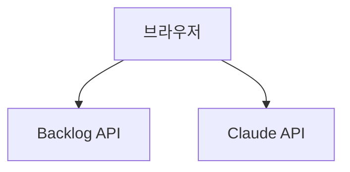

# 바이브 코딩 튜토리얼 — DirectCloud FAQ 자동 분석 도구

> 비개발자를 위한 바이브 코딩 실전 가이드  
> 이 문서는 실제 워크숍에서 진행한 과정을 그대로 정리한 튜토리얼입니다.

---

## 이 튜토리얼로 배울 수 있는 것

- 내 업무 문제를 AI와 대화로 정의하는 방법
- PRD(제품 요구사항 문서)를 인터뷰 형식으로 만드는 방법
- HTML 목업을 코드 없이 만드는 방법
- GitHub에 결과물을 저장하는 방법

---

## 1단계: 문제 정의 (브레인스토밍)

### 무엇을 했나요?
Claude와 대화하며 업무에서 가장 시간이 많이 걸리는 문제를 찾고, 해결 방안을 3가지 이상 탐색했습니다.

### 사용한 프롬프트

**문제 발견:**
```
저는 브릿지 엔지니어를 담당하고 있습니다.
매일 반복하는 업무 중에서 가장 시간이 많이 걸리는 것은
Backlog Inquiry의 고객 문의 중 홈페이지 FAQ 페이지에 올릴만한
리스트를 뽑아내는 작업입니다.

이 업무를 AI로 자동화하거나 효율화할 수 있는 방법을 함께 고민해주세요.
가능한 해결 방안을 3가지 이상 제안해주시고,
각 방안의 장단점도 함께 알려주세요.
```

**방향 구체화:**
```
가장 도전적인 세 번째 방안이 가장 현실적인 것 같아요.
이 방향으로 더 구체적으로 발전시켜주세요.
- 이 해결책이 실제로 동작하려면 어떤 데이터가 필요한가요?
- 비개발자인 제가 직접 만들 수 있는 범위는 어디까지인가요?
- 가장 빠르게 효과를 볼 수 있는 최소 버전(MVP)은 무엇인가요?
```

**기술적 실현 가능성 확인:**
```
이 아이디어를 웹 앱이나 도구로 만든다면,
바이브 코딩(AI에게 자연어로 지시해서 만드는 방식)으로 구현 가능할까요?
어떤 기술 스택이 적합한지, 난이도는 어느 정도인지 알려주세요.
```

### 어떤 결과물이 나왔나요?
- 해결 방안 3가지 + 장단점 비교
- 선택한 방안의 MVP 범위 정의
- 기술 스택 결정 (HTML + Claude API + Backlog API)
- 산출물: `ideation.md`

### 팁
- 막연하게 "자동화해줘"보다 **구체적인 상황과 숫자**를 포함하면 훨씬 좋은 결과가 나옵니다
- 결과가 마음에 들지 않으면 "세 번째 방안을 더 구체적으로"처럼 **파고들기** 질문을 하세요
- AI가 제안한 방안 중 가장 끌리는 것을 고르면 됩니다 — 정답은 없어요

---

## 2단계: PRD 작성 (심층 인터뷰)

### 무엇을 했나요?
Claude가 인터뷰어 역할을 하며 질문을 던졌고, 답변을 바탕으로 PRD를 자동 생성했습니다.

### 인터뷰에서 다룬 질문들
Claude가 선택지 형태로 물어본 질문들:

```
Q. 이 도구를 사용할 사람은 누구인가요?
→ 나 혼자 (브릿지 엔지니어)

Q. FAQ 후보 결과를 어떤 형태로 받고 싶으신가요?
→ 웹 화면에서 바로 확인

Q. 얼마나 자주 실행할 예정인가요?
→ 월 1회

Q. 결과 화면에서 꼭 보고 싶은 정보는 무엇인가요?
→ FAQ 적합도 점수, FAQ 초안 문구, Backlog 원본 링크, 유사 문의 묶음, 카테고리 분류

Q. 분석 대상 문의 기간은 어느 정도로 설정할까요?
→ 최근 12개월
```

### 어떤 결과물이 나왔나요?
- 기능 요구사항 7개 (F-01 ~ F-07)
- 사용자 스토리 4개
- 성공 지표 (30~60분 → 5분 이내)
- 산출물: `docs/PRD.md`

### 팁
- "잘 모르겠어요"도 괜찮습니다 — Claude가 선택지를 제안해줘요
- 인터뷰 답변이 곧 PRD의 내용이 됩니다 — 솔직하게 답변할수록 좋아요
- PRD는 나중에 수정 가능하니 완벽하게 하려 하지 않아도 됩니다

---

## 3단계: 목업 제작

### 무엇을 했나요?
PRD를 바탕으로 실제 동작하는 HTML 목업을 만들었습니다. DirectCloud 내부 UI 스타일(다크 테마)로 제작했어요.

### 사용한 프롬프트
```
PRD 내용을 기반으로 동작하는 HTML 목업을 만들어줘.

조건:
- DirectCloud 기존 내부 UI 스타일 (어두운 계열)
- 단일 HTML 파일 (브라우저에서 바로 열 수 있게)
- 샘플 데이터를 넣어서 실제 동작하는 것처럼 보이게
- FAQ 카드 클릭 시 초안 + 유사 문의 펼치기/접기
```

### 어떤 결과물이 나왔나요?
- 상단 네비게이션 (DirectCloud 로고 + 분석 실행 버튼)
- 통계 카드 4개 (분석된 문의 / FAQ 후보 / 유사 그룹 / 초안 생성)
- 사이드바 필터 (카테고리 / 적합도)
- FAQ 카드 목록 (클릭 시 초안 + 유사 문의 펼침)
- 산출물: `mockup/index.html`

### 팁
- 목업은 여러 번 수정해도 됩니다 — "이 버튼 색을 바꿔줘"처럼 구체적으로 요청하세요
- 마음에 드는 디자인 레퍼런스가 있으면 "이런 스타일로"라고 알려주세요
- 완벽한 목업보다 **방향을 잡는 것**이 목적입니다

---

## 4단계: 개발 계획 + GitHub 이슈 등록

### 무엇을 했나요?
개발 작업을 12개로 나누고, GitHub 이슈로 등록했습니다.

### 사용한 프롬프트 (Claude Code)
```
gh CLI를 사용해서 GitHub 이슈를 등록해줘.
MVP 작업은 'MVP' 라벨, 선택 기능은 'enhancement' 라벨을 붙여줘.
각 이슈에 작업 배경, 작업 내용, 인수 조건, 선행 작업을 포함해줘.
```

### 어떤 결과물이 나왔나요?
- Phase 1 MVP: 이슈 #1~#8 (`MVP` 라벨)
- Phase 2 선택 기능: 이슈 #9~#12 (`enhancement` 라벨)
- 각 이슈에 선행 이슈 `#번호` 링크 연결
- 산출물: `development-plan.md` + GitHub 이슈 12개

---

## 5단계: 아키텍처 문서화

### 무엇을 했나요?
시스템 전체 구조를 Mermaid 다이어그램으로 시각화하고, README를 작성했습니다.

### Mermaid란?
코드로 다이어그램을 그리는 도구입니다. GitHub에서 자동으로 렌더링되어 별도 이미지 없이도 볼 수 있어요.



### 어떤 결과물이 나왔나요?
- 시스템 전체 구조 다이어그램
- 데이터 흐름 (Sequence Diagram)
- 컴포넌트 관계도
- 산출물: `docs/ARCHITECTURE.md` + `README.md`

---

## 바이브 코딩 핵심 패턴 정리

### 패턴 1: 역할 + 맥락 + 출력 형식
```
저는 [직무]입니다.
[현재 상황]에서 [문제]가 있어요.
[원하는 결과물 형식]으로 만들어주세요.
```

### 패턴 2: 파고들기 (구체화)
```
[선택한 방안]이 가장 좋아 보여요.
더 구체적으로 발전시켜주세요.
특히 [궁금한 점]을 알고 싶어요.
```

### 패턴 3: 수정 요청
```
결과를 확인했는데 몇 가지 수정해주세요:
- [수정 사항 1]
- [수정 사항 2]
```

### 패턴 4: 파일 저장 요청 (Claude Code)
```
지금까지 만든 내용을 [파일명]으로 저장하고
GitHub에 "[커밋 메시지]"로 커밋 후 푸시해줘.
```

---

## 이 프로젝트의 전체 커밋 이력

| 커밋 | 내용 | 단계 |
|------|------|------|
| `e56f0b6` | docs: add ideation.md | 1단계 |
| `434758c` | docs: add PRD.md | 2단계 |
| `071bd60` | feat: add mockup/index.html | 3단계 |
| `d727347` | docs: add development-plan.md | 4단계 |
| `3c45d56` | docs: add ARCHITECTURE.md | 5단계 |
| `382caa5` | docs: update README.md | 5단계 |
